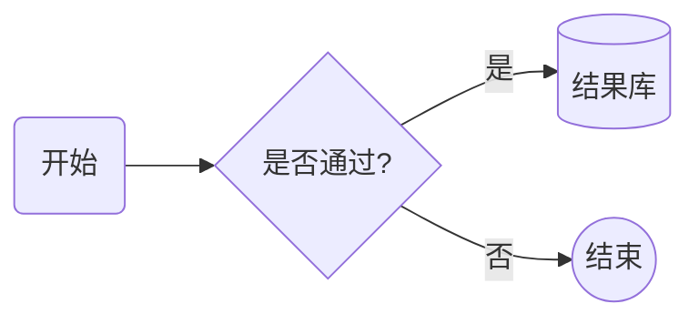
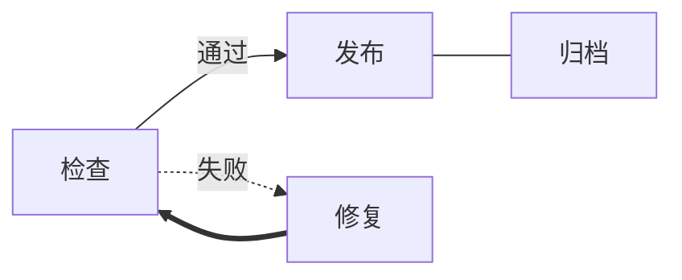
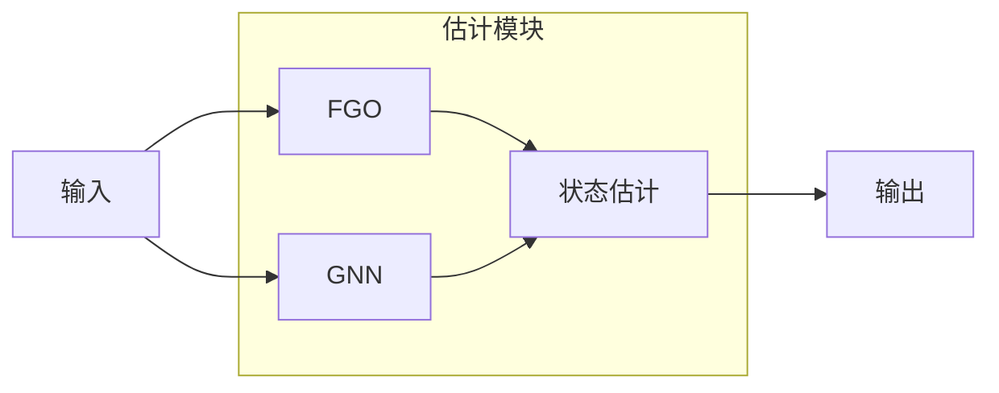
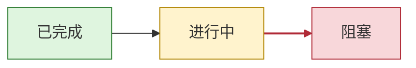
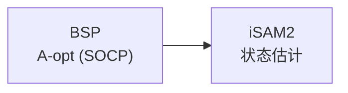
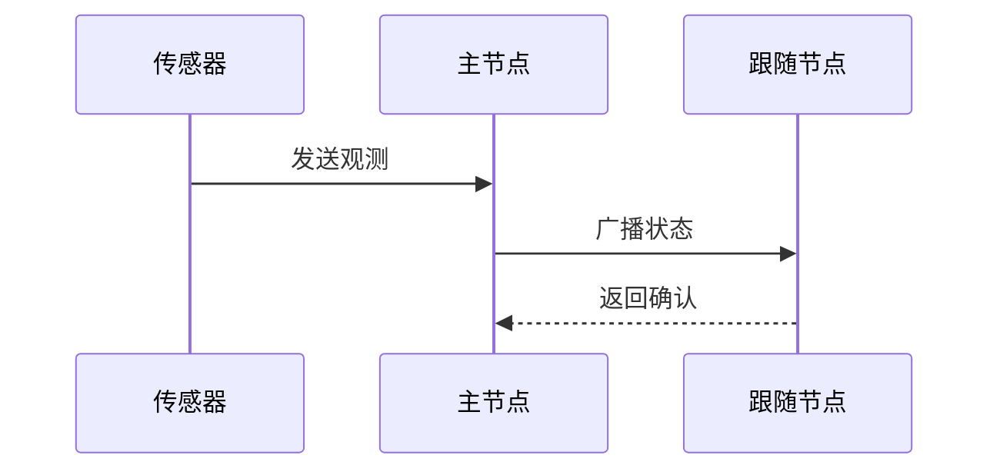
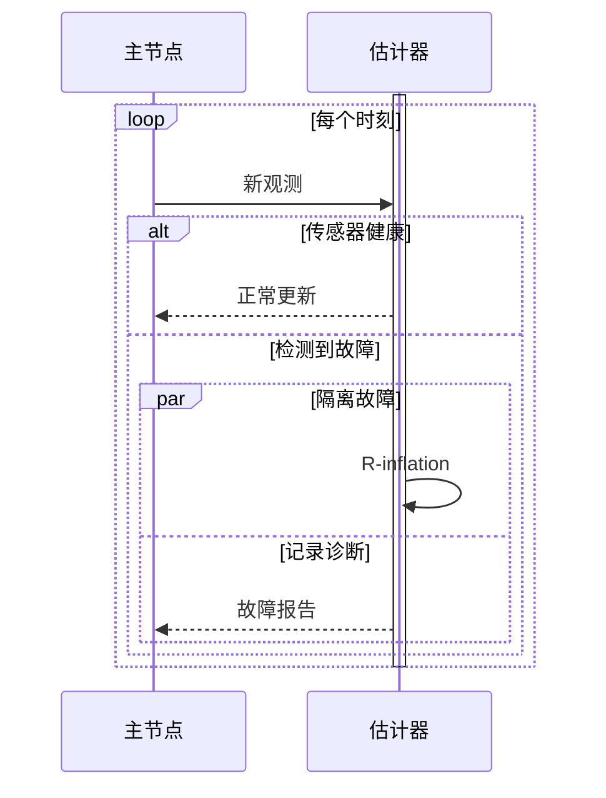
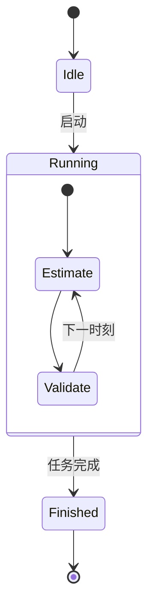
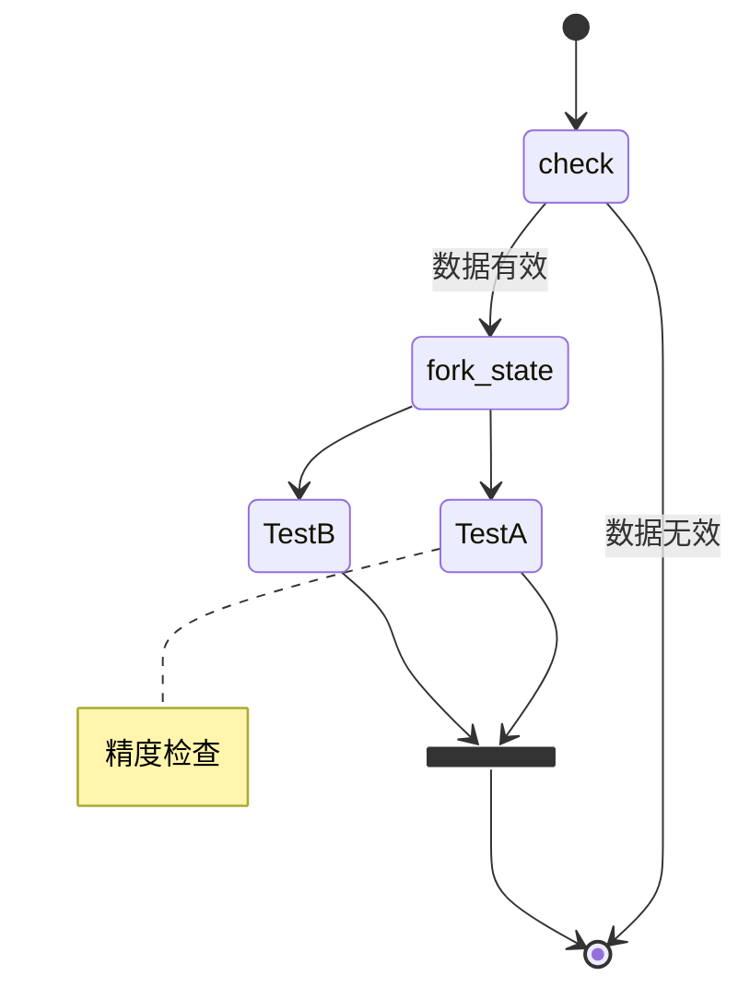

# Mermaid 常用作图语法表

> 用法：在 Markdown 中写入 ```` ```mermaid ```` 代码块。本文按每 3–4 个指令配一个最简图组织，可直接复制修改。不同编辑器内置的 Mermaid 版本可能不同；语法以 [Mermaid 官方文档](https://mermaid.js.org/intro/)为准。

## 1. 流程图：方向、节点与基本连线

| 指令 | 作用 | 最简写法 |
| --- | --- | --- |
| `flowchart TD` | 从上到下布局 | `flowchart TD` |
| `flowchart LR` | 从左到右布局 | `flowchart LR` |
| `A[文本]` | 矩形节点 | `A[读取数据]` |
| `A --> B` | 实线箭头 | `A --> B` |

**源码**

````markdown

````

**渲染效果**


常用方向：`TB/TD`从上到下、`BT`从下到上、`LR`从左到右、`RL`从右到左。

## 2. 流程图：常用节点形状

| 指令 | 作用 | 最简写法 |
| --- | --- | --- |
| `A(文本)` | 圆角矩形 | `A(开始)` |
| `B{文本}` | 菱形判断 | `B{是否通过?}` |
| `C[(文本)]` | 数据库/圆柱 | `C[(结果库)]` |
| `D((文本))` | 圆形节点 | `D((结束))` |

**源码**

````markdown

````

**渲染效果**


其他常用形状：`A[[子程序]]`、`A[/输入输出/]`、`A>旗形节点]`。

## 3. 流程图：线型与边标签

| 指令 | 作用 | 最简写法 |
| --- | --- | --- |
| `A -- 标签 --> B` | 带文字的实线箭头 | `A -- 通过 --> B` |
| `A -.-> B` | 虚线箭头 | `A -.-> B` |
| `A ==> B` | 粗实线箭头 | `A ==> B` |
| `A --- B` | 无箭头实线 | `A --- B` |

**源码**

````markdown

````

**渲染效果**


边标签也可写成`A -->|通过| B`。需要增加线长时，可增加中间符号，例如`---->`、`-.--->`。

## 4. 流程图：链式连接、分支与子图

| 指令 | 作用 | 最简写法 |
| --- | --- | --- |
| `A --> B --> C` | 链式连接 | `A --> B --> C` |
| `A --> B & C` | 一对多分支 | `A --> B & C` |
| `subgraph ... end` | 建立节点分组 | `subgraph 模块A ... end` |
| `direction TB` | 设置子图内部方向 | `direction TB` |

**源码**

````markdown

````

**渲染效果**


子图可设置稳定ID：`subgraph estimator[估计模块]`。跨子图连线仍使用节点ID。

## 5. 流程图：节点与边样式

| 指令 | 作用 | 最简写法 |
| --- | --- | --- |
| `classDef` | 定义可复用样式 | `classDef ok fill:#dfd` |
| `class` | 给节点应用样式 | `class A,B ok` |
| `style` | 直接设置单个节点 | `style C fill:#fdd` |
| `linkStyle` | 设置指定序号的边 | `linkStyle 0 stroke:red` |

**源码**

````markdown

````

**渲染效果**


`linkStyle`的边序号从`0`开始，按边在源码中的出现顺序计算。结构频繁变化时少用边序号样式。

## 6. 流程图：文本、注释与链接

| 指令 | 作用 | 最简写法 |
| --- | --- | --- |
| `A["文本"]` | 安全包裹特殊字符 | `A["A-opt (SOCP)"]` |
| `<br/>` | 节点内换行 | `A["第一行<br/>第二行"]` |
| `%%` | 单行注释 | `%% 不参与渲染` |
| `click` | 给节点添加链接 | `click A "URL"` |

**源码**

````markdown

````

**渲染效果**


`click`是否生效取决于渲染器的安全级别；普通项目文档不要依赖它表达关键信息。

## 7. 时序图：参与者与消息

| 指令 | 作用 | 最简写法 |
| --- | --- | --- |
| `sequenceDiagram` | 声明时序图 | `sequenceDiagram` |
| `participant` | 定义参与者 | `participant A as 主节点` |
| `A ->> B: 消息` | 实线消息箭头 | `A ->> B: 发送观测` |
| `B -->> A: 返回` | 虚线返回箭头 | `B -->> A: 返回估计` |

**源码**

````markdown

````

**渲染效果**


常见箭头：`->`无箭头实线、`-->`无箭头虚线、`->>`实线箭头、`-->>`虚线箭头、`-x`末端叉号。

## 8. 时序图：激活、条件、循环与并行

| 指令 | 作用 | 最简写法 |
| --- | --- | --- |
| `activate/deactivate` | 显示参与者活动区间 | `activate A` |
| `alt/else/end` | 条件分支 | `alt 正常 ... else 故障 ... end` |
| `loop/end` | 循环片段 | `loop 每个时刻 ... end` |
| `par/and/end` | 并行片段 | `par 分支1 ... and 分支2 ... end` |

指令：`%%{init: {"themeVariables": {"activationBkgColor": "transparent", "activationBorderColor": "#000000"}}}%%`\
作用：设置激活生命线（连接顶部估计器和底部估计器的竖直窄条）的填充色和边框色。

**源码**

````markdown

````

**渲染效果**


## 9. 状态图：状态、转移与复合状态

| 指令 | 作用 | 最简写法 |
| --- | --- | --- |
| `stateDiagram-v2` | 声明状态图 | `stateDiagram-v2` |
| `[*]` | 初始或终止状态 | `[*] --> Idle` |
| `A --> B: 事件` | 带事件的状态转移 | `Idle --> Run: 启动` |
| `state X { ... }` | 定义复合状态 | `state Run { ... }` |

**源码**

````markdown

````

**渲染效果**


状态显示名可与ID分离：`state "等待输入" as Waiting`。

## 10. 状态图：判断、分叉、汇合与注释

| 指令 | 作用 | 最简写法 |
| --- | --- | --- |
| `<<choice>>` | 判断节点 | `state check <<choice>>` |
| `<<fork>>` | 并行分叉 | `state fork_state <<fork>>` |
| `<<join>>` | 并行汇合 | `state join_state <<join>>` |
| `note right of` | 添加说明 | `note right of A: 说明` |

**源码**

````markdown

````

**渲染效果**


## 11. 类图：类、成员与关系

| 指令 | 作用 | 最简写法 |
| --- | --- | --- |
| `classDiagram` | 声明类图 | `classDiagram` |
| `class A { ... }` | 定义类及成员 | `class A { +run() }` |
| `<|--` | 继承 | `Base <|-- Child` |
| `*--` | 组合 | `Graph *-- Node` |

**源码**

````markdown
```mermaid
classDiagram
    class BaseNode {
        +run(state)
    }
    class ValidateNode {
        +validate(result)
    }
    class Graph {
        +invoke(state)
    }
    BaseNode <|-- ValidateNode
    Graph *-- BaseNode
```
````

**渲染效果**

```mermaid
classDiagram
    class BaseNode {
        +run(state)
    }
    class ValidateNode {
        +validate(result)
    }
    class Graph {
        +invoke(state)
    }
    BaseNode <|-- ValidateNode
    Graph *-- BaseNode
```

其他关系：`o--`聚合、`-->`关联、`..>`依赖、`..|>`实现。

## 12. 类图：多重性、标签与成员可见性

| 指令 | 作用 | 最简写法 |
| --- | --- | --- |
| `"1" -- "*"` | 标注关系多重性 | `Graph "1" *-- "*" Node` |
| `: 标签` | 标注关系含义 | `Graph --> State : 更新` |
| `+ - # ~` | public/private/protected/package | `+run()`、`-cache` |
| `$` | static成员 | `+build()$` |

**源码**

````markdown
```mermaid
classDiagram
    class Graph {
        +build()$
        +invoke()
        -compiled
    }
    class Node {
        +run()
        #state
    }
    class State {
        ~trace
    }
    Graph "1" *-- "3" Node : 包含
    Node --> State : 更新
```
````

**渲染效果**

```mermaid
classDiagram
    class Graph {
        +build()$
        +invoke()
        -compiled
    }
    class Node {
        +run()
        #state
    }
    class State {
        ~trace
    }
    Graph "1" *-- "3" Node : 包含
    Node --> State : 更新
```

## 13. 甘特图：日期、分组与任务依赖

| 指令 | 作用 | 最简写法 |
| --- | --- | --- |
| `gantt` | 声明甘特图 | `gantt` |
| `dateFormat` | 设置输入日期格式 | `dateFormat YYYY-MM-DD` |
| `section` | 建立任务分组 | `section 模块开发` |
| `after ID` | 声明前置依赖 | `任务B :b, after a, 3d` |

**源码**

````markdown
```mermaid
gantt
    title v0.3.3 开发计划
    dateFormat YYYY-MM-DD
    section 因子图
    迁移6-DoF状态 :a, 2026-08-24, 5d
    回归测试       :b, after a, 3d
    section GNN
    重建数据链     :c, after a, 4d
```
````

**渲染效果**

```mermaid
gantt
    title v0.3.3 开发计划
    dateFormat YYYY-MM-DD
    section 因子图
    迁移6-DoF状态 :a, 2026-08-24, 5d
    回归测试       :b, after a, 3d
    section GNN
    重建数据链     :c, after a, 4d
```

常用状态：`done`已完成、`active`进行中、`crit`关键任务、`milestone`里程碑。

## 14. 饼图与XY图：简单数据展示

### 14.1 饼图

| 指令 | 作用 | 最简写法 |
| --- | --- | --- |
| `pie` | 声明饼图 | `pie` |
| `title` | 设置标题 | `title 故障类型` |
| `showData` | 显示数值 | `pie showData` |
| `"名称": 数值` | 添加数据项 | `"正常": 80` |

**源码**

````markdown
```mermaid
pie showData
    title 传感器状态占比
    "健康" : 80
    "退化" : 15
    "失效" : 5
```
````

**渲染效果**

```mermaid
pie showData
    title 传感器状态占比
    "健康" : 80
    "退化" : 15
    "失效" : 5
```

### 14.2 XY图

| 指令 | 作用 | 最简写法 |
| --- | --- | --- |
| `xychart-beta` | 声明XY图 | `xychart-beta` |
| `x-axis` | 定义横轴 | `x-axis [1, 2, 3]` |
| `y-axis` | 定义纵轴范围 | `y-axis "RMSE" 0 --> 5` |
| `line/bar` | 绘制折线或柱状数据 | `line [3, 2, 1]` |

**源码**

````markdown
```mermaid
xychart-beta
    title "位置RMSE"
    x-axis "实验编号" [1, 2, 3, 4]
    y-axis "RMSE / m" 0 --> 5
    line [4.2, 2.8, 1.5, 0.7]
    bar [4.5, 3.0, 1.8, 0.9]
```
````

**渲染效果**

```mermaid
xychart-beta
    title "位置RMSE"
    x-axis "实验编号" [1, 2, 3, 4]
    y-axis "RMSE / m" 0 --> 5
    line [4.2, 2.8, 1.5, 0.7]
    bar [4.5, 3.0, 1.8, 0.9]
```

`xychart-beta`在旧版Mermaid或部分Markdown预览器中可能不可用，论文级数据图仍建议使用Matplotlib。

## 15. 时间线与思维导图

### 15.1 时间线

| 指令 | 作用 | 最简写法 |
| --- | --- | --- |
| `timeline` | 声明时间线 | `timeline` |
| `title` | 设置标题 | `title 项目演化` |
| `section` | 建立阶段分组 | `section v0.3` |
| `时期 : 事件` | 添加时间点 | `2026-06 : 完成闭环` |

**源码**

````markdown
```mermaid
timeline
    title 项目主要阶段
    section v0.2
        2026-05 : BSP联合优化
    section v0.3
        2026-06 : 四模块闭环
        2026-08 : 6-DoF迁移规划
```
````

**渲染效果**

```mermaid
timeline
    title 项目主要阶段
    section v0.2
        2026-05 : BSP联合优化
    section v0.3
        2026-06 : 四模块闭环
        2026-08 : 6-DoF迁移规划
```

### 15.2 思维导图

| 指令 | 作用 | 最简写法 |
| --- | --- | --- |
| `mindmap` | 声明思维导图 | `mindmap` |
| `root((文本))` | 定义根节点 | `root((项目))` |
| 缩进 | 定义父子层级 | 子项比父项多一级缩进 |
| `节点[文本]` | 指定矩形节点 | `FGO[状态估计]` |

**源码**

````markdown
```mermaid
mindmap
    root((联合编队着陆))
        规划
            GFOLD
            BSP
        估计
            FGO[iSAM2]
        健康评估
            GNN[GAT]
```
````

**渲染效果**

```mermaid
mindmap
    root((联合编队着陆))
        规划
            GFOLD
            BSP
        估计
            FGO[iSAM2]
        健康评估
            GNN[GAT]
```

## 16. 本项目推荐用法

| 场景 | 推荐图型 | 建议位置 |
| --- | --- | --- |
| 四模块总体关系 | `flowchart LR` | `研究计划.md`总体架构 |
| 任务依赖与验收路径 | `flowchart TD/LR` | `研究计划.md`、`Plan_3_3.md` |
| 主从通信与handoff | `sequenceDiagram` | 因子图设计文档 |
| 故障模式切换 | `stateDiagram-v2` | GNN训练与集成文档 |
| 模块接口和对象关系 | `classDiagram` | 对应模块README |
| 阶段排期 | `gantt` | 仅需要时间计划时使用 |
| 定量论文结果 | Matplotlib，不用Mermaid | 论文图表目录 |

维护原则：

1. 每张图只表达一个主题，通常控制在5–15个节点。
2. 节点ID使用稳定英文短名，显示标签可使用中文。
3. 任务状态仍以任务表为权威源，图只表达依赖和流程。
4. Mermaid源码直接放在对应权威Markdown文档中，不额外建立图数据库或生成流水线。
5. 修改相关模块、任务依赖或接口时，同步检查邻近Mermaid图。

## 官方语法入口

- [流程图 Flowchart](https://mermaid.js.org/syntax/flowchart.html)
- [时序图 Sequence diagram](https://mermaid.js.org/syntax/sequenceDiagram.html)
- [状态图 State diagram](https://mermaid.js.org/syntax/stateDiagram.html)
- [类图 Class diagram](https://mermaid.js.org/syntax/classDiagram.html)
- [甘特图 Gantt](https://mermaid.js.org/syntax/gantt.html)
- [饼图 Pie chart](https://mermaid.js.org/syntax/pie.html)
- [XY图](https://mermaid.js.org/syntax/xyChart.html)
- [时间线 Timeline](https://mermaid.js.org/syntax/timeline.html)
- [思维导图 Mindmap](https://mermaid.js.org/syntax/mindmap.html)
